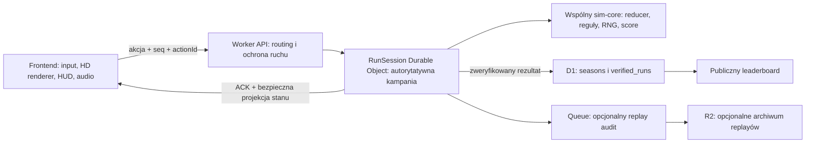

# Server-Authoritative Ranked Leaderboard — szczegółowy plan wdrożenia Season 1

**Status:** zatwierdzony kierunek architektury; dokument planistyczny, bez uruchamiania operacji produkcyjnych.

**Cel:** zastąpić obecny leaderboard oparty na deklaracjach klienta trybem `Ranked Online`, w którym Cloudflare Worker i Durable Object posiadają autorytatywny stan kampanii, wykonują wszystkie reguły gry i samodzielnie wyliczają wynik. Po ukończeniu HD reworku stara baza D1 ma zostać wyeksportowana, usunięta i zastąpiona pustą bazą rozpoczynającą historię od `season-1`.

**Najważniejsza zasada:** frontend wysyła wyłącznie intencje gracza. Nigdy nie wysyła wiarygodnych wartości `depth`, `gold`, `turns`, `score`, HP, ekwipunku ani rezultatu runu.

**Zakres ochrony:** manipulacja `localStorage`, DevTools, pamięcią klienta, bezpośrednimi requestami, debug menu, scenariuszami QA, RNG, kolejnością requestów, powtórzeniami requestów i spreparowanymi wynikami.

**Poza pełną gwarancją Season 1:** bot lub makro wykonujące wyłącznie legalne akcje oraz trwały ban konkretnej osoby bez systemu kont. Backend uniemożliwi botowi stworzenie niemożliwego stanu, ale nie rozpozna niezawodnie, czy legalne decyzje podejmował człowiek.

---

## 1. Ustalenia, których plan nie może naruszyć

1. HD rework i ranked są osobnymi granicami:
   - renderer, assety, Canvas, HUD, audio i VFX pozostają frontendowe;
   - encje, tury, walka, RNG, progresja kampanii i wynik należą do symulacji;
   - zmiana ranked nie może modyfikować assetów HD ani soundtracku.
2. `Ranked Online` wymaga sieci. Obecna gra lokalna pozostaje jako `Practice / Unranked` i może nadal używać lokalnego save'a.
3. Obecny `season-5` i wszystkie starsze wpisy są traktowane jako nieweryfikowalne. Nie będą importowane do nowej bazy.
4. Nowa historia leaderboardu zaczyna się od `season-1`, niezależnie od numeru wersji gry.
5. Obecne heurystyki tur, głębokości i złota zostają usunięte. Nie będą „dostrajane”.
6. Heurystyka statystyczna nigdy samodzielnie nie oznacza gracza jako cheatera, nie usuwa wyniku i nie nakłada bana.
7. Operacyjne zabezpieczenia nowego API pozostają: autoryzacja sesji, walidacja schematu akcji, idempotencja, ścisła kolejność tur, limity payloadu, rate limiting, Turnstile na początku kampanii, CORS allowlist i logi.

---

## 2. Decyzja produktowa wymagana przed implementacją

Obecny kod traktuje `currentRunId` jak całą kampanię obejmującą kilka wypraw, żyć, ekstrakcji i wizyt w obozie, ale zeruje licznik tur przy każdym `startRun()`. Jednocześnie `runGoldEarned` kumuluje się po kolejnych ekstrakcjach. To powoduje zarówno false positive w obecnym Workerze, jak i legalne pompowanie wyniku przez farming.

Plan przyjmuje następujący model domyślny:

- **Ranked Campaign** zaczyna się przy `New Game` przed wyborem pierwszego reliktu.
- Kończy się po ostatecznym `Game Over` albo zwycięstwie na depth 100.
- Ekstrakcja, obóz i kolejne zejście tworzą nowy `segmentId`, ale zachowują jedno `campaignId`.
- Backend prowadzi dwa liczniki: monotoniczny `campaignTurns` oraz osobny `segmentTurns`.
- Leaderboard Season 1 sortuje przede wszystkim po `maxDepth`, następnie po liczbie pokonanych bossów, a przy remisie po mniejszej liczbie `campaignTurns`.
- Złoto jest widoczną statystyką, ale **nie wpływa na ranking Season 1**. Usuwa to zachętę do nieskończonego farmingu.
- Jeśli punkty mają pozostać w UI, rekomendowany wzór Season 1 to `maxDepth * 1000 + bossClears * 2500`; wylicza go wyłącznie `sim-core` na backendzie.

Jeżeli właściciel wybierze ranking pojedynczej wyprawy zamiast kampanii, należy zmienić kontrakt przed rozpoczęciem Fazy 2. Nie wolno mieszać obu modeli w jednej tabeli.

---

## 3. Docelowa architektura



Durable Object jest jednostką koordynacji jednej kampanii. Ma prywatny, SQLite-backed storage, ścisłą kolejność operacji oraz stan RNG. Nowa klasa musi być utworzona przez migrację `new_sqlite_classes`, zgodnie z aktualnymi wymaganiami Cloudflare: [Durable Objects migrations](https://developers.cloudflare.com/durable-objects/reference/durable-objects-migrations/).

### 3.1 Źródło prawdy

| Dane | Practice / Unranked | Ranked Online |
|---|---|---|
| Input | klient | klient wysyła intencję |
| Pozycje, HP, przeciwnicy | klient | Durable Object |
| RNG gameplay | klient | Durable Object, seed nieujawniany klientowi |
| RNG wizualny | klient | klient |
| Relikty, skille, camp upgrades | klient | Durable Object |
| Save | `localStorage` | Durable Object; klient przechowuje tylko identyfikator i capability do resume |
| Score/depth/gold/turns | klient | `sim-core` na backendzie |
| Rendering i animacje | klient | klient |
| Wpis do leaderboardu | brak | wyłącznie wynik terminalnego stanu serwera |

### 3.2 Minimalny protokół Ranked v1

#### `POST /api/ranked/v1/campaigns`

Cel: rozpoczęcie kampanii.

Klient może wysłać wyłącznie:

```json
{
  "playerName": "Player",
  "protocolVersion": "ranked-v1",
  "clientVersion": "v0.7.0",
  "turnstileToken": "opaque-token"
}
```

Worker:

- waliduje Turnstile po stronie serwera;
- wybiera aktywne `seasonId=season-1` i `rulesetId=ranked-rules-v1` — klient nie może ich ustawić;
- generuje `campaignId`, capability sesji i sekretne początkowe RNG;
- tworzy Durable Object;
- zwraca początkową projekcję stanu i `nextSeq=1`.

#### `POST /api/ranked/v1/campaigns/:campaignId/actions`

```json
{
  "actionId": "uuid",
  "seq": 17,
  "type": "move",
  "payload": { "dx": 0, "dy": -1 },
  "clientStateHash": "diagnostic-only"
}
```

Reguły:

- `seq` musi być dokładnie równy `nextSeq`;
- ponowienie identycznego `actionId` zwraca poprzedni ACK bez ponownego wykonania;
- ten sam `seq` z inną akcją zwraca `409 sequence_conflict`;
- nielegalna akcja nie zmienia stanu;
- `clientStateHash` służy tylko do diagnozy, nigdy do autoryzacji;
- odpowiedź zawiera nowy `nextSeq`, projekcję/diff stanu i hash stanu serwera.

#### `GET /api/ranked/v1/campaigns/:campaignId`

Cel: resume i resynchronizacja. Zwraca ostatnią bezpieczną projekcję stanu, `nextSeq` i status kampanii.

#### `POST /api/ranked/v1/campaigns/:campaignId/finalize`

Klient nie przesyła wyniku. Endpoint może wyłącznie poprosić o finalizację, a Durable Object akceptuje ją tylko wtedy, gdy jego stan jest terminalny. Wpis D1 jest wyliczany z autorytatywnego stanu.

#### `GET /api/ranked/v1/leaderboard?season=season-1&limit=20`

Zwraca wyłącznie rekordy `verified_runs`. `season-1` może być parametrem odczytu, ale aktywna pora roku i reguły zapisu pozostają backendowe.

### 3.3 Kanoniczne akcje

Faza 1 musi zinwentaryzować wszystkie istniejące wejścia i przypisać je do zamkniętej listy, m.in.:

- `move`;
- `use_skill`;
- `use_elixir`;
- `request_extract` / `confirm_extract`;
- `choose_starting_relic` / `choose_relic` / `discard_relic`;
- `buy_camp_upgrade`;
- `set_mutator`;
- `select_start_depth`;
- `merchant_action`;
- `forge_action`;
- `pact_action`;
- `continue_from_camp`;
- `abandon_campaign`.

Nie wolno przyjmować nazw funkcji JavaScript, dowolnych patchy stanu ani obiektów encji jako akcji.

---

## 4. Docelowa struktura repozytorium

Implementację należy rozpocząć dopiero z ustalonego, czystego commita kończącego HD rework albo w zatwierdzonym osobnym worktree. Obecnych niepowiązanych zmian użytkownika nie wolno nadpisywać.

```text
dungeon-2.0/
  packages/
    sim-core/
      src/
        actions.js
        reducer.js
        rng.js
        scoring.js
        serialization.js
        state.js
        index.js
      tests/
    ranked-protocol/
      src/
        action-schema.js
        errors.js
        state-hash.js
        index.js
      tests/
  ranked-client.js
  cloudflare/
    leaderboard-worker/
      src/
        index.js
        run-session.js
        leaderboard.js
        auth.js
        limits.js
        telemetry.js
      migrations/
        0001_ranked_season1.sql
      test/
      wrangler.toml
      package.json
  scripts/
    capture-ranked-e2e.mjs
    season1-cutover.ps1
  tests/
    ranked-client.test.js
    ranked-unranked-boundary.test.js
    ranked-golden-replays.test.js
```

Nowy Worker ma powstać z czystego szkieletu w aktywnym repo. Stary plik z `archieve/cloudflare/leaderboard-worker` jest materiałem audytowym, a nie bazą do dalszego deployu.

---

## 5. Elementy starego Workera do usunięcia

Usunąć należy mechanizmy udające weryfikację gameplayu. Nie usuwać ochrony infrastruktury nowego API.

### 5.1 Usunąć całkowicie

Ze starego `src/worker.js` i `wrangler.toml`:

- `DEFAULT_MIN_TURNS_PER_DEPTH`, `MIN_ALLOWED_TURNS_PER_DEPTH`, `MAX_ALLOWED_TURNS_PER_DEPTH`;
- `DEFAULT_MIN_TURNS_FOR_LEADERBOARD`, `MIN_ALLOWED_TURNS_FOR_LEADERBOARD`, `MAX_ALLOWED_TURNS_FOR_LEADERBOARD`;
- zmienne `MIN_TURNS_PER_DEPTH` i `MIN_TURNS_FOR_LEADERBOARD` z konfiguracji;
- `resolveTurnsRules()`;
- `evaluateTurnsHeuristic()`;
- `maxGoldForDepth()` jako heurystykę anty-cheat;
- klientowy `normalizeEntry()` przyjmujący depth/gold/turns/score;
- `isEntryPlausible()`;
- porównanie klientowego score z `computeScore()`;
- `leaderboard_run_flags`, `ensureRunFlagsTable()` i `upsertRunFlag()`;
- `is_suspicious`, powody `avg_turns_per_depth_too_low` i `missing_turns`;
- stary `leaderboard_reject_events` oraz `/api/admin/rejects` związane z fałszywymi heurystykami;
- dynamiczne `CREATE TABLE` i `ALTER TABLE` wykonywane podczas requestów;
- `/api/leaderboard/start`;
- `/api/leaderboard/finalize`;
- publiczny `POST /api/leaderboard` przyjmujący gotowy wynik;
- `run_sessions`, stare run tokeny, finalize nonce i submit sequence — zastępuje je stan/capability Durable Object;
- klientowo podawane `season`, `version`, `endedAt` i `ts` jako dane wiarygodne;
- `scope=legacy` i prezentowanie starych wyników razem z verified;
- wildcard `Access-Control-Allow-Origin: *`;
- mechanizm „lepszy wynik dla tego samego runId” oparty na klienckich agregatach.

### 5.2 Przenieść do `sim-core`

- limity wynikające z zasad gry, np. maksymalna głębokość;
- obliczanie punktów;
- legalność start depth;
- reguły złota, bossów, żyć, camp upgrades, mutatorów i outcome;
- serializację autorytatywnego stanu.

Nie mogą to być konfigurowalne progi anty-cheat w Workerze. Mają być wersjonowaną częścią `rulesetId`.

### 5.3 Zachować lub zastąpić

- `sanitizeName()` — zachować jako walidację danych prezentacyjnych;
- JSON response helpers — zachować;
- `GET /api/health` — rozbudować o `workerBuild`, `protocolVersion`, `rulesetId`, `activeSeason` i status bindingów;
- D1 prepared statements — zachować dla publicznego odczytu i finalnych insertów;
- SHA-256 — wykorzystać do digestu replay/state, nie jako dowód integralności klienta;
- stare telemetryczne „rejects” zastąpić neutralnymi zdarzeniami: `auth_failed`, `invalid_schema`, `illegal_action`, `sequence_conflict`, `rate_limited`, `ruleset_mismatch`, `server_error`;
- rate limiting używać przeciw spamowi, nie do rozstrzygania uczciwości. Cloudflare zaznacza, że binding jest celowo permissive/eventually consistent: [Rate Limiting](https://developers.cloudflare.com/workers/runtime-apis/bindings/rate-limit/).

### 5.4 Sekrety

Pliki `admin api key.txt` i `reject log salt.txt` należy uznać za ujawnione:

- stare wartości unieważnić;
- usunąć pliki z katalogu Workera i wszystkich paczek deploymentowych;
- dodać `.dev.vars*` i `.env*` do `.gitignore`;
- deklarować wymagane sekrety w konfiguracji;
- produkcyjne wartości ustawiać przez Worker Secrets, nigdy przez `[vars]` ani pliki śledzone przez Git. Zgodnie z dokumentacją Cloudflare sekrety nie powinny trafiać do repozytorium: [Workers Secrets](https://developers.cloudflare.com/workers/configuration/secrets/).

---

## 6. Nowy model danych

### 6.1 Durable Object `RunSession`

Każdy obiekt przechowuje:

```text
campaign_meta
  campaign_id
  season_id
  ruleset_id
  protocol_version
  player_name
  status
  created_at
  last_action_at
  next_seq
  terminal_at

simulation_state
  serialized_state
  rng_state
  state_hash

segments
  segment_id
  started_at_seq
  ended_at_seq
  outcome

actions
  seq PRIMARY KEY
  action_id UNIQUE
  type
  payload_json
  state_hash_after
  accepted_at
```

Aktualizacja akcji, RNG, snapshotu i `next_seq` musi być atomowa. Ten sam poprawny retry zwraca wcześniejszą odpowiedź.

### 6.2 Nowa, pusta D1

`0001_ranked_season1.sql` tworzy tylko nowe tabele:

#### `seasons`

```text
id PRIMARY KEY                -- season-1
ruleset_id
status                        -- scheduled | active | closed
starts_at
ends_at NULL
created_at
```

#### `verified_runs`

```text
campaign_id PRIMARY KEY
season_id
ruleset_id
protocol_version
player_name
outcome                       -- victory | final_death
max_depth
bosses_cleared
campaign_turns
segments_completed
gold_earned_display_only
score
started_at_server
finished_at_server
worker_build
final_state_hash
replay_digest NULL
verified_at
```

#### `security_events`

Neutralna diagnostyka techniczna bez pola `is_cheater`:

```text
id PRIMARY KEY
event_at
request_id
campaign_id NULL
event_code
route
metadata_json
```

Publiczne zapytanie leaderboardu czyta wyłącznie `verified_runs` dla aktywnego sezonu. Stany `abandoned`, `expired`, `invalid_protocol` i błędy klienta pozostają w Durable Object/telemetrii i nigdy nie pojawiają się jako score.

---

## 7. Siedem faz wdrożenia

### Faza 1 — zamrożenie kontraktu Ranked Rules v1 i przygotowanie repo

**Cel:** rozpocząć pracę bez dotykania produkcyjnej bazy i bez konfliktu z trwającym HD reworkiem.

**Pliki:**

- utworzyć `docs/ranked/ranked-rules-v1.md`;
- utworzyć `docs/ranked/protocol-v1.md`;
- utworzyć root `package.json` tylko dla skryptów/testów nowych pakietów;
- utworzyć strukturę `packages/` i `cloudflare/leaderboard-worker/`;
- nie modyfikować jeszcze aktywnego endpointu ani D1.

**Kroki:**

1. Zatwierdzić granicę kampanii i scoring opisany w sekcji 2.
2. Sporządzić kompletną mapę istniejących input handlerów do kanonicznych akcji.
3. Zdefiniować serializowalny stan symulacji bez DOM, audio, assetów i obiektów renderera.
4. Zdefiniować publiczną projekcję stanu potrzebną rendererowi.
5. Zdefiniować kody odpowiedzi i retry behavior.
6. Przenieść kopię starego Workera do materiałów referencyjnych tylko na czas implementacji; deploy source ma wskazywać wyłącznie nowy katalog.
7. Zabezpieczyć CI/testy kontraktem, że `config.js` pozostaje w `TEST_MODE=true` aż do Fazy 6.

**Bramka ukończenia:** żadna funkcja implementacyjna nie powstaje przed zatwierdzeniem `ranked-rules-v1.md` i `protocol-v1.md`.

### Faza 2 — deterministyczny `sim-core`

**Cel:** jedna implementacja reguł możliwa do uruchomienia w przeglądarce, Node i Workerze.

**Pliki:**

- utworzyć moduły `packages/sim-core/src/*`;
- utworzyć `packages/ranked-protocol/src/*`;
- utworzyć golden fixtures i testy;
- stopniowo modyfikować `game.js`, aby Practice korzystał z reducerów bez zmiany zachowania gry.

**Kolejność ekstrakcji:**

1. Typy akcji i walidacja payloadów.
2. Stan kampanii, segmentu i tury.
3. Jawny deterministyczny PRNG dla gameplayu.
4. Generowanie pokoju i przeciwników.
5. Ruch, kolizje, walka i kolejka przeciwników.
6. Loot, relikty, skille, forge, pact, merchant i camp.
7. Ekstrakcja, życie, Game Over i zwycięstwo.
8. Scoring i finalny stan.

**Wymagania RNG:**

- żadna reguła gameplayu nie używa bezpośrednio `Math.random()`;
- particles, camera shake, VFX i warianty graficzne korzystają z osobnego visual RNG;
- testy dowodzą, że włączenie HD/Classic i różny framerate nie zmieniają stanu symulacji;
- server RNG state nie jest wysyłany klientowi w Ranked.

**Testy obowiązkowe:**

- ten sam stan + RNG + akcja daje identyczny wynik;
- nielegalna akcja nie mutuje stanu ani RNG;
- serializacja i deserializacja zachowują hash;
- 100+ golden replayów przechodzi identycznie w Node i bundle przeglądarkowym;
- obecne scenariusze QA oraz bot mogą działać wyłącznie w Practice;
- dotychczasowe testy gameplayu nadal przechodzą;
- audio freeze i testy HD nie wykazują zmian.

**Bramka ukończenia:** pełna kampania może zostać odtworzona wyłącznie z początkowego stanu, RNG oraz listy akcji.

### Faza 3 — nowy Worker, Durable Object i pusta schema D1 lokalnie

**Cel:** backend przyjmuje akcje, nie wyniki.

**Pliki:**

- implementować `cloudflare/leaderboard-worker/src/index.js`;
- implementować `run-session.js`, `auth.js`, `limits.js`, `leaderboard.js`, `telemetry.js`;
- dodać `wrangler.toml` z osobnymi środowiskami `dev`, `staging`, `production`;
- dodać migrację DO `new_sqlite_classes = ["RunSession"]`;
- dodać `migrations/0001_ranked_season1.sql`;
- dodać testy z oficjalnym środowiskiem Workers/Vitest.

**Kroki implementacyjne:**

1. Zbudować `/health` z pełną tożsamością buildu.
2. Zbudować `POST /campaigns` i serwerową walidację Turnstile. Token Turnstile jest krótko ważny i single-use, dlatego musi być walidowany przez Siteverify: [Turnstile server-side validation](https://developers.cloudflare.com/turnstile/get-started/server-side-validation/).
3. Utworzyć capability kampanii i przechowywać wyłącznie jego hash.
4. Zaimplementować DO z atomicznym `applyAction()`.
5. Dodać resume, abandon i terminal finalize.
6. Dodać idempotentny insert do `verified_runs`.
7. Dodać publiczny read-only leaderboard.
8. Dodać CORS allowlist dla faktycznych originów gry.
9. Dodać limity rozmiaru body i zamkniętą listę content types.
10. Dodać rate limit osobno dla create, actions i resume; dokładną kolejność nadal egzekwuje DO, nie rate limiter.

**Testy obowiązkowe:**

- klientowy `depth`, `gold`, `turns`, `score`, `season` lub `ruleset` jest odrzucany przez schema;
- nie da się finalizować stanu nieterminalnego;
- równoległe akcje nie wykonują się podwójnie;
- identyczny retry jest bezpieczny;
- zmieniony retry zwraca konflikt;
- restart/eviction DO nie traci stanu;
- finalny wpis D1 powstaje dokładnie raz;
- niepoprawny token i Turnstile nie tworzą kampanii;
- rate limit nie oznacza runu jako cheatera;
- wszystkie DDL są w migracjach, nigdy w request handlerze.

**Bramka ukończenia:** spreparowany request z wysokim wynikiem nie ma endpointu, który mógłby go przyjąć.

### Faza 4 — integracja klienta Ranked i usunięcie starego protokołu

**Cel:** frontend renderuje stan backendu i nie posiada ścieżki uploadu agregatów.

**Pliki:**

- utworzyć `ranked-client.js`;
- zmodyfikować `index.html`, `game.js`, `config.js` i UI leaderboardu;
- dodać `tests/ranked-client.test.js` oraz `tests/ranked-unranked-boundary.test.js`;
- usunąć stary klientowy kod leaderboardu.

**Kroki:**

1. Dodać wybór `Ranked Online` / `Practice` przed New Game.
2. W Ranked przechwycić kanoniczne akcje przed lokalną mutacją stanu.
3. Wyświetlać oczekiwanie/animację, a po ACK renderować projekcję serwera.
4. Na utratę sieci pokazywać pause/reconnect; nie kontynuować Ranked offline.
5. Retry wysyła dokładnie ten sam `actionId`.
6. Resume pobiera stan z DO; lokalny snapshot nie może nadpisać serwera.
7. Scenariusz URL, debug cheats, observer bot i sim runner zawsze uruchamiają Practice.
8. Publiczny leaderboard pokazuje `Verified Season 1` oraz stan `pending` tylko dla własnego finalizowanego runu.

**Usunąć z klienta:**

- `STORAGE_LEADERBOARD` i `STORAGE_LEADERBOARD_PENDING`;
- ładowanie oczekujących wpisów z `localStorage`;
- `requestOnlineRunSession()` i `requestOnlineFinalizeNonce()`;
- `submitLeaderboardEntryOnline()`;
- `recordRunOnLeaderboard()` przesyłający agregaty;
- `currentRunToken`, `currentRunTokenExpiresAt`, `currentRunSubmitSeq` ze stanu gameplayu i save'a;
- klientowo sterowany `DUNGEON_LEADERBOARD_SEASON`;
- fallback pokazujący lokalne wyniki jako ranking online;
- komunikaty sugerujące, że `stored:false` było sukcesem.

**Migracja lokalnego storage:**

- po pierwszym uruchomieniu nowego buildu jednorazowo usunąć `dungeonOneRoomLeaderboardV1` i `dungeonOneRoomLeaderboardPendingV1`;
- nie usuwać lokalnego Practice save'a;
- Ranked przechowuje osobny minimalny resume record, bez autorytatywnych statystyk.

**Bramka ukończenia:** edycja dowolnej wartości w `localStorage` nie zmienia projekcji Ranked po następnym ACK/resume.

### Faza 5 — shadow mode, replay audit i pełne QA przed release

**Cel:** udowodnić zgodność klienta i backendu przed stworzeniem Season 1.

**Etapy środowiskowe:**

1. `local`: Worker, DO i D1 lokalne.
2. `staging`: oddzielny Worker, DO namespace i preview D1.
3. `shadow`: klient wykonuje Practice lokalnie i równolegle wysyła akcje do staging; wynik nie jest publikowany.
4. `internal canary`: rzeczywisty Ranked dostępny tylko dla QA.
5. `production disabled`: backend wdrożony, ale tworzenie kampanii zwraca `season_not_active`.

**Replay audit:**

- zakończony DO może utworzyć immutable action log i digest;
- opcjonalny Queue consumer odtwarza kampanię drugi raz i porównuje finalny hash;
- jeżeli Queue stanie się bramką publikacji, job musi być idempotentny po `campaignId`, ponieważ Queues dostarcza wiadomości co najmniej raz: [Queues delivery guarantees](https://developers.cloudflare.com/queues/reference/delivery-guarantees/);
- replaye top wyników mogą być archiwizowane w R2 bez danych sekretów.

**Macierz QA:**

- pełna kampania: start, relikt, walka, ekstrakcja, camp, restart segmentu, śmierć, kolejne życie, finał;
- wszystkie skille, relikty, mutatory, merchant, forge, pact, vault, pits i boss phases;
- resume po reloadzie, utracie sieci i timeoutach;
- duplicate, reorder, concurrent action i retry;
- zmiana `localStorage`, DevTools i ręcznie spreparowany stary payload;
- uruchomienie `?scenario=final_chamber_transition` nie tworzy Ranked;
- debug god mode nie jest akcją protokołu;
- HD/Classic daje identyczny state hash;
- desktop/mobile nie mają nowych błędów UI;
- zero regresji audio i HD assetów;
- latency telemetry: p50/p95 ACK oraz liczba reconnectów, bez arbitralnego odrzucania szybkich graczy.

**Wymagane bramki:**

- zero różnic state hash w golden/shadow corpus;
- zero legitimate runów odrzuconych przez deterministyczny verifier;
- wszystkie błędy mają jawny kod i zachowują możliwość diagnozy;
- brak ścieżki, która publicznie nazywa użytkownika cheaterem;
- pełny test suite projektu i Worker tests przechodzą;
- końcowa kontrola wizualna HD oraz audio freeze przechodzą;
- produkcyjne sekrety nie występują w plikach ani diffie.

### Faza 6 — wyczyszczenie D1 i uruchomienie Verified Season 1

**Cel:** spełnić wymaganie całkowicie czystej historii rankingu po HD reworku.

**Ważne:** ta faza jest destrukcyjna i może zostać wykonana dopiero po osobnym potwierdzeniu bezpośrednio przed cutoverem. Skrypt ma domyślnie działać w trybie dry-run i nie może używać `--skip-confirmation` przy usuwaniu bazy.

#### 6.1 Bramki przed resetem

- HD rework posiada zatwierdzony freeze/release commit;
- produkcyjny build ma debug cheats wyłączone i scenariusze QA oznaczone unranked;
- Worker v2, DO i nowa schema przeszły Fazę 5;
- istnieje przetestowany rollback do poprzedniego statycznego buildu;
- stary leaderboard został przełączony read-only / submissions disabled;
- właściciel potwierdził nazwę i ID starej bazy oraz konto Cloudflare;
- sprawdzono liczbę rekordów przed eksportem.

#### 6.2 Eksport starej bazy

Cloudflare wspiera pełny eksport zdalnej D1 do SQL: [D1 export](https://developers.cloudflare.com/d1/best-practices/import-export-data/).

Planowana operacja:

```powershell
npx wrangler d1 export dungeon-one-room-leaderboard --remote --output=leaderboard-pre-season1.sql
Get-FileHash -Algorithm SHA256 .\leaderboard-pre-season1.sql
```

Wymagania:

- backup trafi poza repozytorium i poza paczkę gry;
- hash zostanie zapisany w prywatnej notatce release;
- wykonać testowy import backupu do tymczasowej lokalnej D1;
- żadnego starego wiersza nie importować do nowej produkcyjnej bazy.

#### 6.3 Utworzenie nowej, pustej D1

Zamiast wykonywać serię `DROP TABLE` na aktywnej bazie, plan tworzy nową bazę. Daje to czysty schemat, bez pozostałości starych tabel i możliwość rollbacku przed finalnym usunięciem starej D1.

```powershell
npx wrangler d1 create dungeon-ranked-leaderboard
npx wrangler d1 migrations apply dungeon-ranked-leaderboard --remote
```

Następnie:

- wpisać nowe `database_id` do produkcyjnego bindingu;
- zweryfikować, że istnieją wyłącznie nowe tabele i `d1_migrations`;
- potwierdzić `COUNT(*) = 0` w `verified_runs` i `security_events`;
- dodać dokładnie jeden rekord `season-1` ze statusem `scheduled`;
- zweryfikować `/health`: właściwy Worker build, `ranked-v1`, `ranked-rules-v1`, `season-1`;
- wdrożyć Worker nadal z blokadą tworzenia kampanii.

Migracje mają być wersjonowanymi plikami i stosowane przez `wrangler d1 migrations apply`, zgodnie z dokumentacją D1: [D1 migrations](https://developers.cloudflare.com/d1/reference/migrations/).

#### 6.4 Cutover

1. Wdrożyć frontend wskazujący Worker v2.
2. Sprawdzić, że stary `POST /api/leaderboard` zwraca przez jeden okres przejściowy `410 legacy_protocol_retired`, a nie przyjmuje wyniku.
3. Aktywować rekord `season-1` po stronie backendu.
4. Wykonać dwie kontrolowane kampanie: zakończoną śmiercią i zwycięstwem/testowym terminal state w środowisku produkcyjnym QA.
5. Usunąć wpisy QA przed publicznym otwarciem albo użyć osobnego produkcyjnego canary season niewidocznego publicznie.
6. Potwierdzić, że publiczny Season 1 startuje z zerową liczbą wyników.
7. Otworzyć tworzenie kampanii dla wszystkich.

#### 6.5 Usunięcie starej D1

Po potwierdzeniu nowego endpointu, backupu i rollbacku stara baza ma zostać usunięta, zgodnie z wymaganiem użytkownika. Oficjalna komenda to `wrangler d1 delete`: [D1 Wrangler commands](https://developers.cloudflare.com/d1/wrangler-commands/).

```powershell
npx wrangler d1 delete dungeon-one-room-leaderboard
```

Warunki:

- komenda wykonywana interaktywnie, bez `--skip-confirmation`;
- operator porównuje wyświetloną nazwę/ID z checklistą release;
- po usunięciu potwierdza, że binding produkcyjny wskazuje wyłącznie nową bazę;
- stary Worker/deployment nie posiada już write route;
- plaintext secret files są usunięte, a stare sekrety unieważnione.

**Bramka ukończenia:** publiczny leaderboard zawiera tylko zweryfikowane wpisy `season-1`, a stara D1 nie istnieje na koncie Cloudflare.

### Faza 7 — monitoring i utrzymanie Season 1

**Pierwsze 72 godziny:**

- monitorować create/action/finalize error rate;
- monitorować p50/p95 czasu ACK;
- monitorować `sequence_conflict`, reconnect i state-hash mismatch;
- ręcznie przejrzeć pierwsze top wyniki wraz z action logiem;
- nie zmieniać rulesetu w trakcie sezonu bez nowego `rulesetId`.

**Pierwsze dwa tygodnie:**

- porównać liczbę rozpoczętych, porzuconych i zakończonych kampanii;
- analizować błędy według wersji klienta i urządzenia;
- zweryfikować, czy żadna grupa legit graczy nie cierpi przez rate limit;
- skalibrować limity ruchu wyłącznie na podstawie telemetrii;
- zachować neutralne komunikaty: „invalid action” lub „run unverifiable”, nie „cheater”.

**Dalsze wzmocnienia:**

- konto/OAuth, jeżeli potrzebne są trwałe bany i odzyskiwanie sesji na innym urządzeniu;
- risk-based Turnstile dla masowego tworzenia kampanii;
- replay archive dla top N;
- niezależny verifier build;
- panel administracyjny przez Cloudflare Access zamiast statycznego bearer key;
- osobny proces zamykania Season 1 i uruchamiania Season 2 bez czyszczenia verified historii.

---

## 8. Kryteria końcowej akceptacji celu „zapobiec cheatowaniu”

1. Nie istnieje endpoint przyjmujący gotowy score, depth, gold ani outcome.
2. Każdy publiczny wynik pochodzi z terminalnego stanu Durable Object.
3. Zmiana `localStorage`, runtime state lub kodu frontendowego nie pozwala zmienić stanu serwera.
4. Debug, scenariusz QA i bot nie są częścią protokołu Ranked.
5. RNG gameplayu jest serwerowy i nie zależy od renderera ani framerate'u.
6. Każda akcja jest uporządkowana, atomowa i idempotentna.
7. Resume przywraca stan serwera, nie klienta.
8. Heurystyki czasu/tur/golda nie odrzucają wyników.
9. Rate limit i Turnstile ograniczają spam, ale nie decydują o wyniku.
10. D1 zawiera tylko `verified_runs` Season 1; nie ma wpisów legacy.
11. Stara D1 została wyeksportowana, zweryfikowana i usunięta.
12. Pełny gameplay, HD, Classic, mobile i audio przechodzą regresję.

---

## 9. Realistyczna kolejność czasowa

| Faza | Szacunek solo | Zależność |
|---|---:|---|
| 1. Kontrakt i repo | 2–4 dni | można zacząć podczas końcówki HD |
| 2. `sim-core` | 2–4 tygodnie | stabilny gameplay/HD freeze ogranicza konflikty |
| 3. Worker + DO + local D1 | 1–2 tygodnie | działający `sim-core` |
| 4. Klient Ranked | 1–2 tygodnie | stabilny protokół |
| 5. Shadow i QA | 1–2 tygodnie | pełny pionowy przepływ |
| 6. Reset i Season 1 | 1 dzień release | wszystkie bramki zielone |
| 7. Monitoring | ciągły | po otwarciu Season 1 |

Realistyczny całkowity czas to około **5–9 tygodni dla jednej osoby**. Największym ryzykiem nie jest Worker, lecz poprawne wydzielenie deterministycznej symulacji z `game.js` bez zmiany zachowania gry i bez naruszenia HD reworku.
